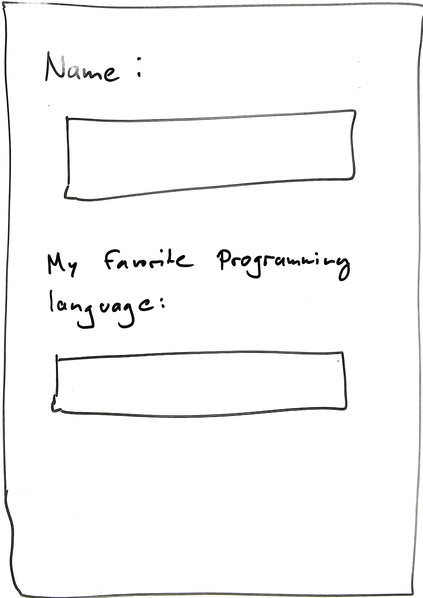

# Homework Assignment 02 -- Software Design & Programming Techniques (WS 2016)
You have two weeks to work on your handin. The deadline for this assignment is
Nov 6th, 23:59. You should form groups of 3 to work on this homework. Please
provide all members names in your handin.

Please form groups of three students first and then use this link to start
working on your homework assignment:

  https://classroom.github.com/group-assignment-invitations/d1a1c33b9a5e2cd0aad4c3a716dd9642

You can hand in your homework in either english or german. See the slides of
[lab 2](https://github.com/ps-tuebingen-sdpt-2016/lecture-notes/blob/master/lab/lab02.pdf) for how to hand in your assignment.

## Task 1. Designing a Library for Surveys (Part I)

In this exercise you should practice to apply the principles introduced in the
lecture and lab sessions. That is, you should apply test-driven development
(TDD), reason about modularity, extensibility and reusability of your design
artifacts, and apply the SOLID principles when appropriate (you need to only
apply those principles that already have been covered in the lecture so far).

Your task is to implement a library that allows your clients to develop
forms to conduct surveys. Here is an example of such a survey form.

In this first step, you will implement the basic functionality of the survey
library. You do not need to implement more than is covered in the following user
stories and remarks. Document your design in a written text and possibly other
auxiliary documentation (for instance UML diagrams etc.) where relevant
considerations of your design are not visible from the sources, tests or
comments contained in the sources. Use JUnit and test your implementation with
unit tests. Try to apply a test driven approach:

1. Write tests
2. Write just enough code to compile and run the tests and see them fail
3. Implement more until the tests succeed.
4. Repeat

Again: The goal of this exercise is not to implement as many features as possible,
       but to reason about your design.

### Involved Parties

There are at least four parties involved in the development and usage of
your product:

- developer (you): Develops the "survey" library.
- survey developer: Implements particular surveys using your library.
- inquirer: Conducts a survey using a running instance of a particular survey.
  Asks users to fill in the survey (at the computer or on paper),
  prints surveys, prints reports.
- user: Subject of a survey. Fills in the form, either on paper or using a
  running instance provided by an inquirer.

### User Stories

#### Story #1
      ------------------------------------------------------------------------
      As a survey developer I want to be able to describe the structure of
      a survey to deliver it as running application to the inquirer.

        Description:
          Using an application programming interface provided by the survey
          library, I want to create individual questions and compose them to
          full surveys.
          This should be done in Java, since I want to abstract over reoccurring
          questions and parts of surveys.

        Acceptance Criteria:
          - library is written in Java
          - the API offered by the library allows to describe questions
          - the API offered by the library allows to describe full surveys
      ------------------------------------------------------------------------

#### Story #2
      ------------------------------------------------------------------------
      As a survey developer I want to be able to automatically validate
      surveys to avoid mistakes in defining them.

        Description:
          For large surveys, sometimes questions occur twice or we forget
          to add a text for questions. It should be possible to perform a
          validation run and check at least for the acceptance criteria.

        Acceptance Criteria:
          - questions that occur multiple times are recognized and rejected
          - questions that have no question text are recognized and rejected
          - empty surveys should be recognized and rejected
      ------------------------------------------------------------------------

#### Story #3
      ------------------------------------------------------------------------
      As a inquirer I want to print a survey in order to hand it to users
      on paper.

        Description:
          Sometimes users cannot come to our office, so we need to send them
          the survey on paper. I need some simple textual representation of
          a survey in order to print it.

        Acceptance Criteria:
          - the text includes the name and description of the survey
          - the text includes all question texts
          - after every question text there should be some space to fill
            in the answer by hand
      ------------------------------------------------------------------------

#### Story #4
      ------------------------------------------------------------------------
      As a user I want to be prompted by the running survey application to
      answer questions one-after-another in order to fill in a survey form.

        Description:
          Seeing all questions at once can be very confusing and reduces
          motivation. Hence, clients should only be exposed to small
          fragments of the survey one-at-a-time. In the end a report should
          be printed.

        Acceptance Criteria:
          - For each question in a survey, the running application should prompt
            the user with the question text.
          - The answers of the user are collected in a report.
          - The report is printed, associating question identifiers with the
            given answer.
          - Answers should not be longer than 50 words or 300 characters.
      ------------------------------------------------------------------------

### Remarks

For this first iteration it is enough to consider only one kind of questions. To
answer such questions users enter text without any formal restriction.
Questions are labeled with text and should additionally have some client chosen
identifier that needs to be unique for the survey the question appears in.
In this iteration, the report containing the answers of the user does not need
to be persisted.

A possible first step is to think about the API that you want to offer to the
survey developer. What operations should be part of the API that allows the
survey developer to construct surveys?

## Task 2. The Single Responsibility Principle (SRP)
Briefly answer the following questions:

1. What is the Single Responsibility Principle (SRP)?
2. What is an axis of change?
3. Identify and list multiple axis of change for the survey library of task 1.
   Which of these changes are more likely?
4. What is cohesion?
5. Does the SRP lead to more and smaller, or fewer and bigger classes?
6. How can the SRP be applied to your implementation of the survey library of task 1?
7. Can you identify violations of the SRP in your implementation? Describe why
   this violation might or might not be a problem.
